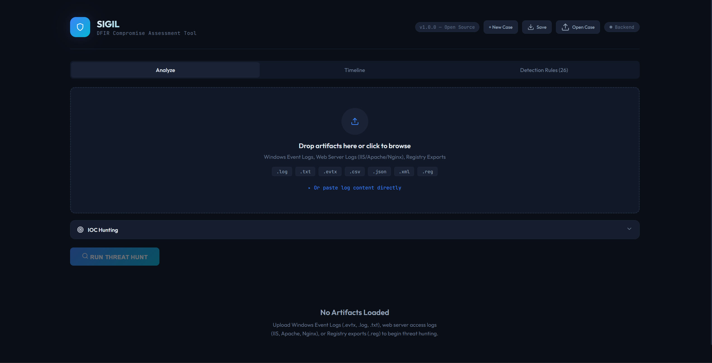
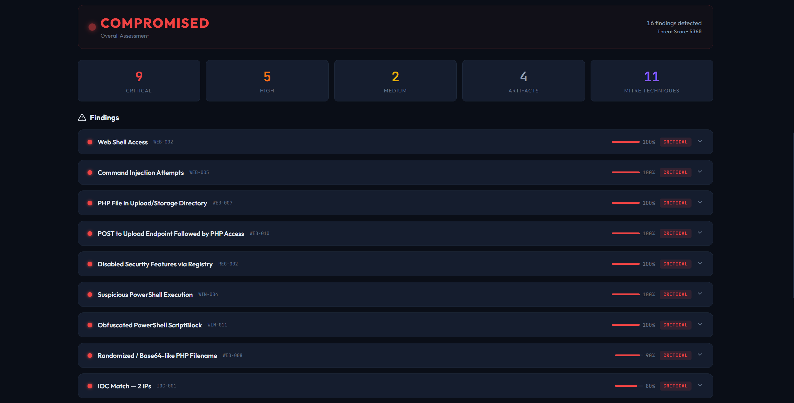
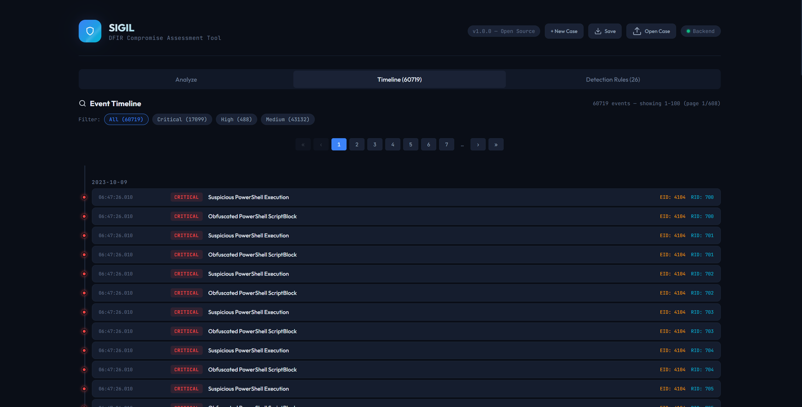

# SIGIL DFIR – Compromise Assessment Tool

SIGIL is an open-source DFIR triage tool designed to help investigators quickly assess potential system compromise using artifacts such as Windows Event Logs, web server logs, and registry data.

## 🔥 Features

* GUI-based (React)
* EVTX parsing (via FastAPI backend)
* Sigma-like detection rules
* MITRE ATT&CK mapping
* Confidence scoring system
* IOC hunting support
* Report generation

## 📸 Preview

### Dashboard


### Findings


### Timeline Interface


## 🏗️ Architecture

Frontend (React) → Backend (FastAPI) → DFIR Parsing Engine

## 🚀 Getting Started

### 1. Clone repo
```
git clone https://github.com/rodelplasabas/sigil-dfir.git
```

### 2. Frontend
```
cd frontend
npm install
npm run dev
```
### 3. Backend

```
cd backend
pip install -r requirements.txt
python -m uvicorn main:app --reload --port 8001
```

## 📊 Supported Artifacts

* Windows Event Logs (.evtx)
* Web Server Logs (IIS, Apache, Nginx)
* Registry exports (.reg)

## Credits & Acknowledgments

Some features are inspired by [Renzon Cruz' IRFlow](https://github.com/r3nzsec/irflow-timeline).

### Open Source Projects

| Project | Usage | Link |
|---------|-------|------|
| **SQLite** | Lightweight, serverless, self-contained, and zero-configuration RDBMS | [sqlite](https://sqlite.org) |
| **evtx** | A cross-platform parser for the Windows XML EventLog format | [omerbenamram/evtx](https://github.com/omerbenamram/evtx) |
| **React** | UI rendering | [facebook/react](https://github.com/facebook/react) |
| **Vite** | Build tooling and hot-reload | [vitejs/vite](https://github.com/vitejs/vite) |

## ⚠️ Disclaimer

This tool is for triage and analysis purposes only. It is not a replacement for full forensic investigation.

## 👨‍💻 Author

Rodel Plasabas
